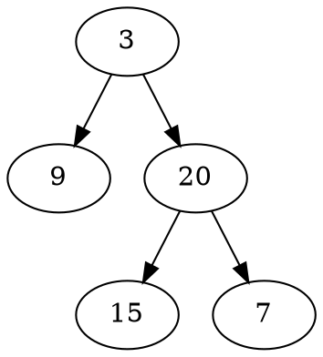

## Introduce
There are many related questions ask to construct the binary tree in Leetcode. This article is a summary of these questions.

[LeetCode 105. Construct Binary Tree from Preorder and Inorder Traversal](https://leetcode.com/problems/construct-binary-tree-from-preorder-and-inorder-traversal/)

[Leetcode 106. Construct Binary Tree from Inorder and Postorder Traversal](https://leetcode.com/problems/construct-binary-tree-from-inorder-and-postorder-traversal/)

[Leetcode 889. Construct Binary Tree from Preorder and Postorder Traversal](https://leetcode.com/problems/construct-binary-tree-from-preorder-and-postorder-traversal/)

## Idea 
We should know it's impossible to construct a binary tree with only one traversal, and the key to solving this kind of questions is how to distinguish the elements of left subtree and right subtree.

## Preorder + Inorder
[LeetCode 105. Construct Binary Tree from Preorder and Inorder Traversal](https://leetcode.com/problems/construct-binary-tree-from-preorder-and-inorder-traversal/)
```
preorder = [3,9,20,15,7]
inorder = [9,3,15,20,7]
```



Features:
1. The first element in preorder (3) must be root of the tree. 
2. All elements on the left hand of (3) in inorder belongs to left subtree.
3. All elements on th right hand of (3) in inorder belongs to right subtree.

```java
class Solution {
    public TreeNode buildTree(int[] preorder, int[] inorder) {
        return build(preorder, inorder, 0, 0, inorder.length - 1);
    }
    private TreeNode build(int[] preorder, int[] inorder, int preorderStart, int inorderStart, int inorderEnd) {
        if (inorderStart > inorderEnd) {
            return null;
        }
        TreeNode head = new TreeNode(preorder[preorderStart]);
        // find mid index
        int midIndex = inorderStart;
        for (int i = inorderStart; i <= inorderEnd; i++) {
            if (inorder[i] == head.val) {
                midIndex = i;
            }
        }
        head.left = build(preorder, inorder, preorderStart + 1, inorderStart, midIndex - 1);
        head.right = build(preorder, inorder, preorderStart + 1 + (midIndex - inorderStart), midIndex + 1, inorderEnd);
        return head;
    }
}
```
## Inorder + Postorder
[Leetcode 106. Construct Binary Tree from Inorder and Postorder Traversal](https://leetcode.com/problems/construct-binary-tree-from-inorder-and-postorder-traversal/)
```
inorder = [9,3,15,20,7]
postorder = [9,15,7,20,3]
```


The only difference is that we find the root of the tree from the tail of the postorder traversal.
```java
class Solution {
    public TreeNode buildTree(int[] inorder, int[] postorder) {
        if (inorder == null || inorder.length == 0 || postorder == null || postorder.length == 0) {
            return null;
        }
        return build(inorder, postorder, postorder.length - 1, 0, inorder.length - 1);
    }
    private TreeNode build(int[] inorder, int[] postorder, int postStart, int inStart, int inEnd) {
        if (postStart >= postorder.length || inStart > inEnd) {
            return null;
        }
        if (inStart == inEnd) {
            return new TreeNode(inorder[inStart]);
        }
        TreeNode root = new TreeNode(postorder[postStart]);
        // find root;
        int rootIndex = inStart;
        for (int i = inStart; i <= inEnd; i++) {
            if (inorder[i] == postorder[postStart]) {
                rootIndex = i;
            }
        }
        root.left = build(inorder, postorder, postStart - (inEnd - rootIndex) - 1, inStart, rootIndex - 1);
        root.right = build(inorder, postorder, postStart - 1, rootIndex + 1, inEnd);
        return root;
    }
}
```

## Preorder + Postorder
[Leetcode 889. Construct Binary Tree from Preorder and Postorder Traversal](https://leetcode.com/problems/construct-binary-tree-from-preorder-and-postorder-traversal/)
```
Input: pre = [1,2,4,5,3,6,7], post = [4,5,2,6,7,3,1]
Output: [1,2,3,4,5,6,7]
```
In the example, we can find root of the tree must be head of preorder or tail of postorder (1).
and then we can divide the subtree manually.
```
pre =   [1, | 2,4,5 |,3,6,7]
post = [4,5,2 |,6,7,3, | 1]
```
we can find that we can use elements next to the root element such as `2 in preorder` and `3 in post order` to divide the subtrees.
```java
class Solution {
    public TreeNode constructFromPrePost(int[] pre, int[] post) {
        if (pre == null || post == null) {
            return null;
        }
        int length = pre.length - 1;
        return build(pre, post, 0, length, 0, length);
    }
    private TreeNode build(int[] pre, int[] post, int preStart, int preEnd, int postStart, int postEnd) {
        if ((preStart > preEnd) || (postStart > postEnd)) {
            return null;
        }
        if (preStart == preEnd) {
            return new TreeNode(pre[preStart]);
        }
        TreeNode root = new TreeNode(pre[preStart]);
        // find left length;
        int leftStart = pre[preStart + 1];
        int leftLength = 0;
        
        while (post[postStart + leftLength] != leftStart) {
            leftLength++;
        }
        leftLength++;
        int rightLength = preEnd - preStart - leftLength;

        root.left = build(pre, post, preStart + 1, preStart + leftLength, postStart, postStart + leftLength - 1);
        root.right = build(pre, post, preStart + leftLength + 1, preEnd, postStart + leftLength, postEnd - 1);
        return root;
    }
}
```